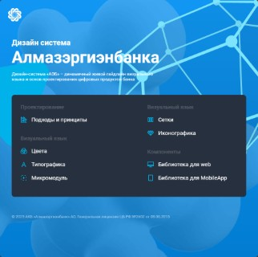
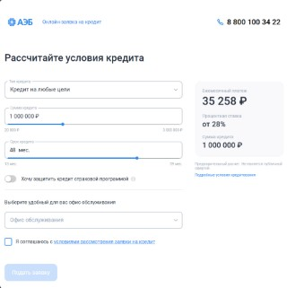
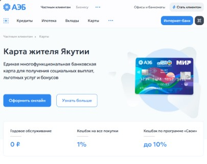
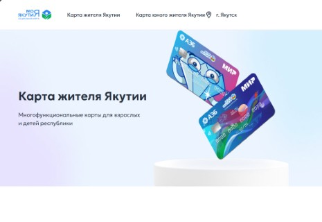
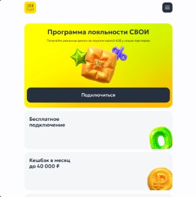
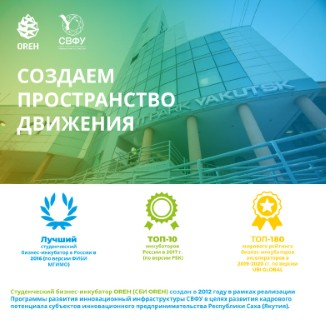

This man that helps businesses grow. Meet...

  
  
  
  

  

10+ years in IT 
6+ years in software development 
5+ years in frontend 
1+ year in DevOps

... and planning to keep doing this way <i>forever</i>

\-  TypeScript |  Ansible |  PowerShell main player  
\- Full Stack Web Developer in  Nest and  Angular  
\- Looking for open source contribution and [available for hiring](https://hire.kenyawest.me/)  

#### Projects and contributions

<table>
<tr>
  <td align="center">
    <b>AEB design system</b> 
    
     
    This includes UI Kit for Angular, React, Vue + design tokens for Figma
  </td>
  <td align="center">
    <b>AEB credits page</b> 
    
     
    Credit calculator, enterprise-grade
  </td>
  <td align="center">
    <b>Card of Sakha Republic citizen</b> 
    
     
    Republic government flagship project
  </td>
</tr>
</table>

  
Need more?
 

  Here are additional projects and contributions:

  <table>
  <tr>
    <td align="center">
      <b>AEB Card of Sakha Republic citizen page & form</b> 
      
       
      This is tied with project №3 above but technically separate
    </td>
    <td align="center">
      <b>AEB loyalty program</b> 
      
       
      Landing, form, and account management
    </td>
    <td align="center">
      <b>OREH Center for Technological Entrepreneurship</b> 
      
       
      <a href="https://www.s-vfu.ru/en">NEFU's</a> initiative to support technological entrepreneurship for it's students. Website is non-existent now
    </td>
  </tr>
  </table>

 

  
<b>🛠 Tech Stack</b>
 

Frontend:

Backend:

DevOps & server administration:

Observability:

Design:

Other from IT:

  

 

Stats:

  
<b>📊 There's forever not enough stats...</b>
 

<!-- Kenya-West's Stats -->
<picture>
  <source
    srcset="https://github-readme-stats-kenyawest.vercel.app/api?username=Kenya-West&custom_title=Kenya-West's+Stats&show=reviews,discussions_started,discussions_answered,prs_merged,prs_merged_percentage&show_icons=true&rank_icon=github&hide_border=true&theme=dark"
    media="(prefers-color-scheme: dark)"
  />
  
</picture>
<!-- Most Used Languages -->
<picture>
  <source
    srcset="https://github-readme-stats-kenyawest.vercel.app/api/top-langs/?username=Kenya-West&layout=donut-vertical&hide_border=true&theme=dark"
    media="(prefers-color-scheme: dark)"
  />
  
</picture>
</a>

<!-- Kenya-West's Wakatime Stats -->
<picture>
  <source
    height="241em"
    srcset="https://github-readme-stats-kenyawest.vercel.app/api/wakatime?username=kenyawest&api_domain=wakapi.dev&layout=compact&hide_border=true&show_icons=true&custom_title=My%20heartbeat&theme=dark&title_color=FAFAFA&icon_color=FAFAFA&text_color=D0D0D0"
    media="(prefers-color-scheme: dark)"
  />
  
</picture>

<!-- Kenya-West's Profile Summary Stats -->
<picture>
  <source
    height="158em"
    srcset="https://github-profile-summary-cards.vercel.app/api/cards/profile-details?username=Kenya-West&theme=dark"
    media="(prefers-color-scheme: dark)"
  />
  
</picture>
<!-- Kenya-West's Profile Summary Stats -->
<picture>
  <source
    height="158em"
    srcset="https://github-profile-summary-cards.vercel.app/api/cards/stats?username=Kenya-West&theme=dark"
    media="(prefers-color-scheme: dark)"
  />
  
</picture>
<!-- Kenya-West's Repos Per Language Stats -->
<picture>
  <source
    height="158em"
    srcset="https://github-profile-summary-cards.vercel.app/api/cards/repos-per-language?username=Kenya-West&theme=dark"
    media="(prefers-color-scheme: dark)"
  />
  
</picture>
<!-- Kenya-West's Most Commit Language Stats -->
<picture>
  <source
    height="160em"
    srcset="https://github-profile-summary-cards.vercel.app/api/cards/most-commit-language?username=Kenya-West&theme=dark"
    media="(prefers-color-scheme: dark)"
  />
  
</picture>
<!-- Kenya-West's Productive Time Stats -->
<picture>
  <source
    height="160em"
    srcset="https://github-profile-summary-cards.vercel.app/api/cards/productive-time?username=Kenya-West&utcOffset=7&theme=dark"
    media="(prefers-color-scheme: dark)"
  />
  
</picture>

  
<b>💲Dunno why you need it but if wanna donate...</b>
 

  

   
   

  

   
   

  

   
   

  

   
   

  

  

  

